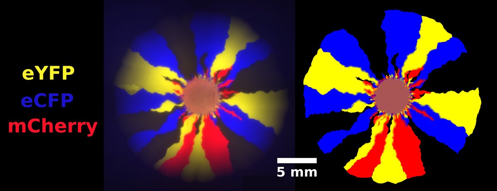
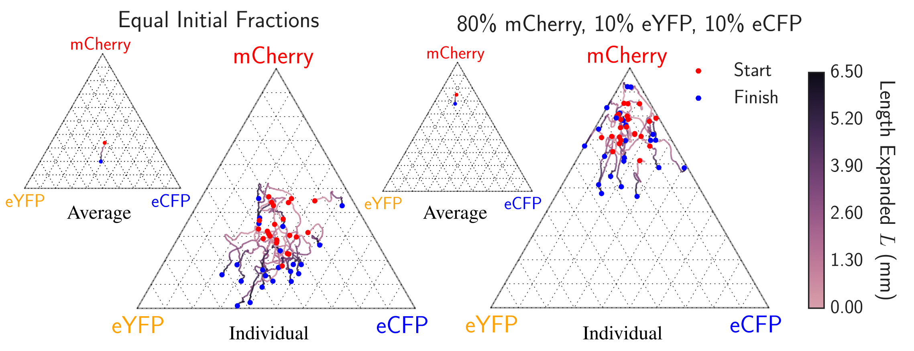
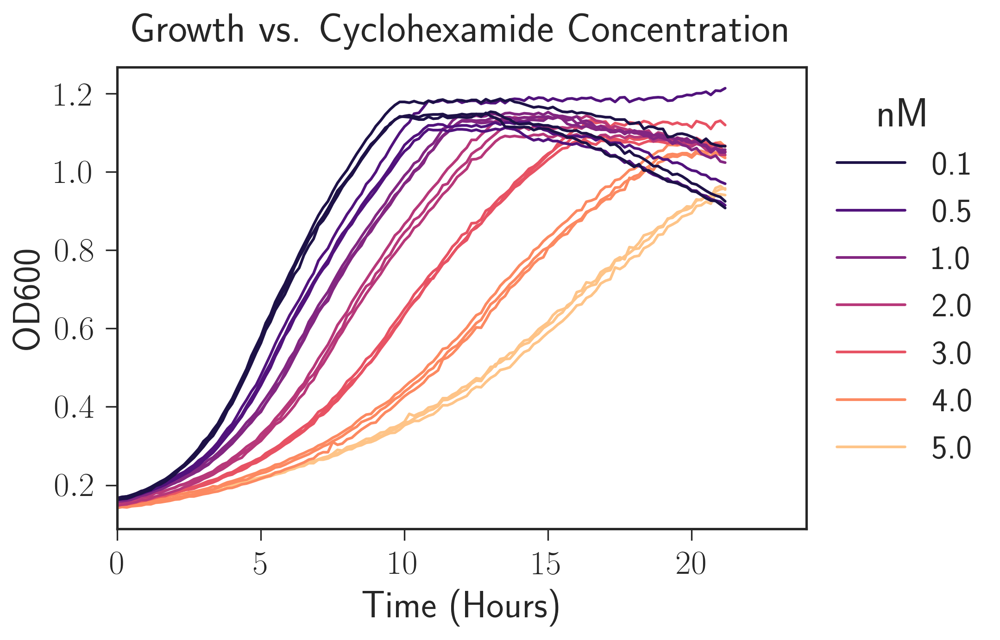
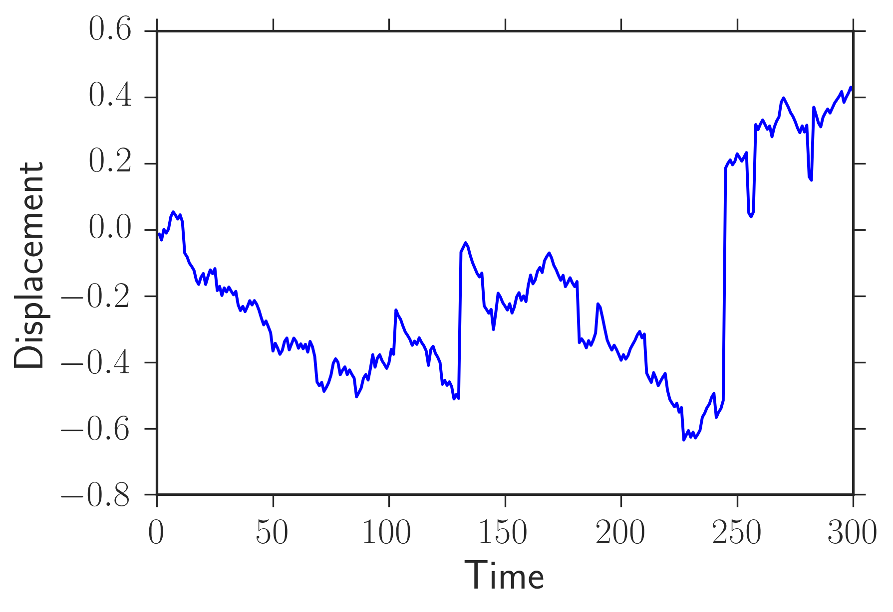
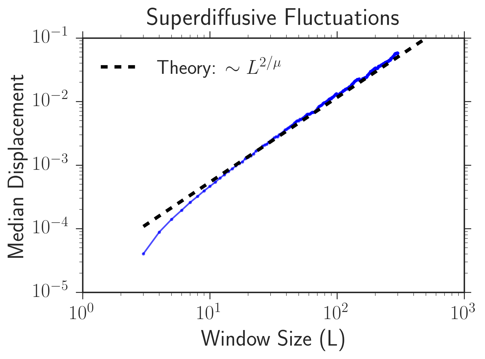

During my PhD, I've written thousands of IPython/Jupyter notebooks to analyze different types
of data that I have encountered (i.e. images, tabular data, etc.). I have used many different python
packages for data analysis, but I must often use

1. `IPython/Jupyter notebook`
1. `matplotlib, seaborn`
1. `numpy, scipy`
1. `pandas`
1. `scikit-image` (for image processing)
1. `pymc3` (mostly for fitting parameters and estimating their likelihood with monte carlo techniques)
1. `cython` and the gnu-scientific library `cython_gsl` (when I need my analysis to go fast)
1. `PyOpenCL` (when I need my analysis to go *even* faster!)

I have authored several packages for my own data analysis needs in the laboratory (see the below).

## Image Analysis for Range Expansion Experiments

I developed my own pipeline to process images and extract relevant information. This code
was extensively used in my [first paper](https://www.biorxiv.org/content/early/2017/06/07/145631). The pipeline
consists of two packages: 

1. [range_expansion_image_analysis_fiji](https://github.com/Range-Expansions/range_expansion_image_analysis_fiji)
2. [range_expansion_image_analysis_python](https://github.com/Range-Expansions/range_expansion_image_analysis_python).

The pipeline begins with the [range_expansion_image_analysis_fiji](https://github.com/Range-Expansions/range_expansion_image_analysis_fiji)
repository where I used Fiji, and open-source image processing library, to  extract binary masks 
illustrating where different strains of fluorescent microbes were located in a colony. 
In the image below, the left was an experiment of mine where  multiple colors of *E. coli* expanded from 
a dense droplet and segregated into one color locally. The image  on the left is experiment, and the image 
on the right was the masks of each strain created using my script. The words "eYFP", "eCFP", and "mCherry" 
are labels for the strains corresponding to the fluroescent proteins that they produce.

 

After using Fiji to create the fluorescent masks, I imported the masks into python  and developed
[range_expansion_image_analysis_python](https://github.com/Range-Expansions/range_expansion_image_analysis_python)
to extract relevant information. My code extensively utilizes `scikit-image`, a standard Python-based image 
processing library. My Python package could extract various quantities such as the spatial correlation between strains, 
the average fraction of each strain vs. colony radius, and was utilized to compare my experimental results 
to theoretical predictions. 

For example, in the linked [IPython notebook](https://github.com/Range-Expansions/range_expansion_image_analysis_python/blob/master/doc/domain_width_example_for_website.ipynb), I used my package to determine the growth of black sectors from experiments similar to that above; the average angular domain width vs. radius is plotted below.

 

Many interesting other plots can be created with the package. For example, I used it to create the figure below illustrating the average fraction of three of the above competing strains (red, yellow, and blue) as a function of colony radius during many experiments. The initial fraction composition is the red dot and the final composition is the blue one. As you can see, the 
fraction trajectories are very stochastic. In my 
[first paper](https://www.biorxiv.org/content/early/2017/06/07/145631), I developed a theory to predict the statistical properties of this motion. In order to create this plot, I helped to develop 
[python-ternary](https://github.com/marcharper/python-ternary) (I created a 
new technique to shade ternary diagrams that worked better for my data).

 

## [Determining the Growth Rate of Microbes](https://github.com/btweinstein/OD_growth_finder)

In order to determine how fast microbes divide (most microbes don't have sex
to reproduce; they just create clones of themselves via "budding"), scientists usually grows 
microbes in a small glass filled with transparent nutritious media. 
As the microbes grow, the media becomes  "murky" and more opaque; it is thus possible to extract the 
growth rate of microbes in culture by measuring how much light is absorbed by the media vs. time.

My colleague @nwespe and I (Nichole is now an insight data science fellow!) wrote the Python package
[OD_growth_finder](https://github.com/btweinstein/OD_growth_finder) to 
extract growth rates of microbes from absorbance data. The package heavily utilized `pandas`
and `numpy`, as modern machines to obtain absorbance data ("Plate Readers") obtain data from many growing
cultures of microbes at once, resulting in data that is naturally tabular. 

See the linked[IPython Notebook](https://github.com/btweinstein/OD_growth_finder/blob/master/OD_growth_analyzer_example.ipynb)
for an idea what the package can do. Below is a plot I created using the package illustrating
how adding an antibiotic (cyclohexamide) to a microbial culture will slow their growth and that,
unsurprisingly, adding the drug in higher concentration slows their growth more.

 

## [Extracting Fluctuation Properties from Time Traces](https://github.com/Range-Expansions/expansion_powerlaw_fit)

As a physicist, I am often interested in studying fluctuations around deterministic trends in time-traces. 
Based on the algorithm discussed in the materials and methods of [this paper](http://www.pnas.org/cgi/doi/10.1073/pnas.0710150104),
I created a `cython` script that takes a time trace as input and then:

1. Creates a window over a given time interval
2. Uses linear regression (using the `cython_gsl` package) to fit the deterministic motion of data over the window.
3. Determines the average mean squared displacement from the linear regression over the window.
4. Loop over all possible windows and apply steps 1-3. 

This is basically a form of "Detrended Fluctuation Analysis. See the linked 
[IPython Notebook](https://github.com/Range-Expansions/expansion_powerlaw_fit/blob/master/doc/powerlaw_fit_example_for_website.ipynb) 
for an example of how I used the package to extract the superdiffusive behavior of a random walker in one dimension. Below, I show an image of a superdiffusive random walk and a quantification of how it fluctuated vs. window length using my cython package. I used this package
to study how the domain walls separating the different colors in my range expansion experiments fluctuated.

 

