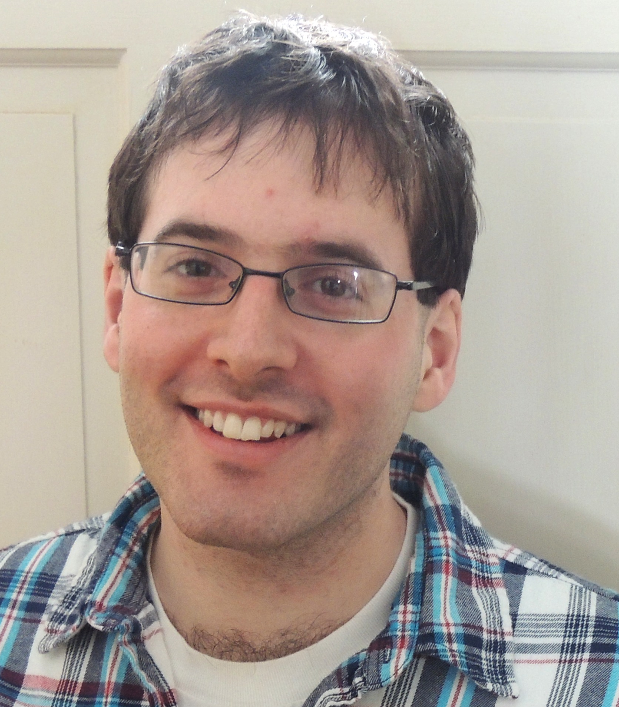

5th year Harvard Applied Physics PhD student with a minor in Computational Science and Engineering (CSE). I will graduate in May and am seeking a job that will begin September 2018.

You can see my full [CV](https://github.com/btweinstein/cv/blob/master/CV.pdf) 
or [resume](https://github.com/btweinstein/cv/blob/master/resume.pdf)
(if you want a more focused, less expansive document). To see my computational portfolio on Github, click the "Computation" tab above.