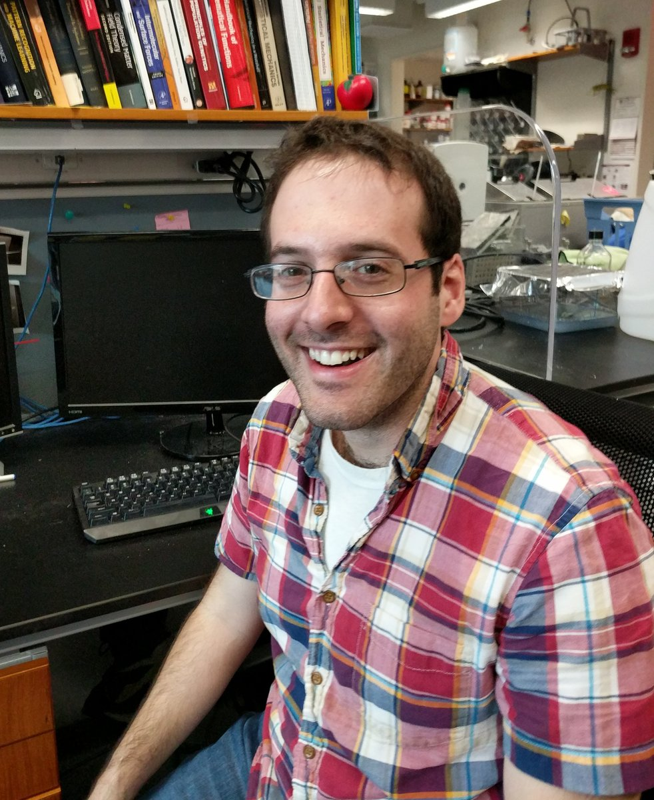

My name is Bryan Weinstein and I am a 5th year Harvard Applied Physics PhD candiate with a minor in Computational Science and Engineering (CSE). I will graduate in May, 2018 and am seeking a full-time position that will begin close to September 1, 2018.

I have two different resumes which can be accessed by clicking the following links (there is quite a bit of overlap between them):
1. [Data Science Resume](documents/data_science_resume.pdf)
2. [Engineering Resume](documents/engineering_resume.pdf) 

I believe that I am well qualified to work either as a data scientist or as an engineer. To see my computational portfolio on GitHub, click the "Computation" tab above.
